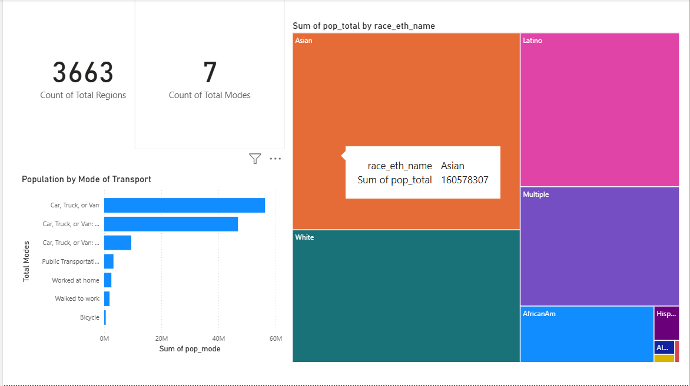

# Azure Real-Time Streaming Data Pipeline

## Objective
This project demonstrates a complete, end-to-end, real-time data pipeline built using core Microsoft Azure services. The objective was to simulate a live stream of transportation data, ingest it, process it in real-time, store it in a data lake, and visualize the final output.

## Architecture
The pipeline follows a classic real-time data processing architecture:

1.  **Data Producer:** A Python script reads from a local CSV file and streams each row as a JSON event.
2.  **Ingestion:** **Azure Event Hub** acts as the high-throughput, real-time message ingress point.
3.  **Processing:** An **Azure Stream Analytics** job subscribes to the Event Hub, running a simple query to process the data in-flight.
4.  **Storage:** The processed data is continuously written to an **Azure Data Lake Storage (ADLS) Gen2** container as JSON files.
5.  **Visualization:** **Power BI** connects directly to the ADLS Gen2 container to model and visualize the processed streaming data.

## Technologies Used
* **Cloud Platform:** Microsoft Azure
* **Ingestion:** Azure Event Hub
* **Stream Processing:** Azure Stream Analytics
* **Storage:** Azure Data Lake Storage Gen2
* **Data Producer:** Python (`azure-eventhub` SDK)
* **BI & Visualization:** Power BI

## Final Output
The final result is a Power BI dashboard that visualizes the cleaned and processed data from the Azure Data Lake.

## Key Learnings
* Hands-on experience with provisioning and configuring core Azure streaming services.
* Practical application of building a data producer in Python to stream data to an Event Hub.
* In-depth troubleshooting of a real-world cloud pipeline, including debugging authentication errors (InvalidSignature), connection issues, and data format mismatches between services.
